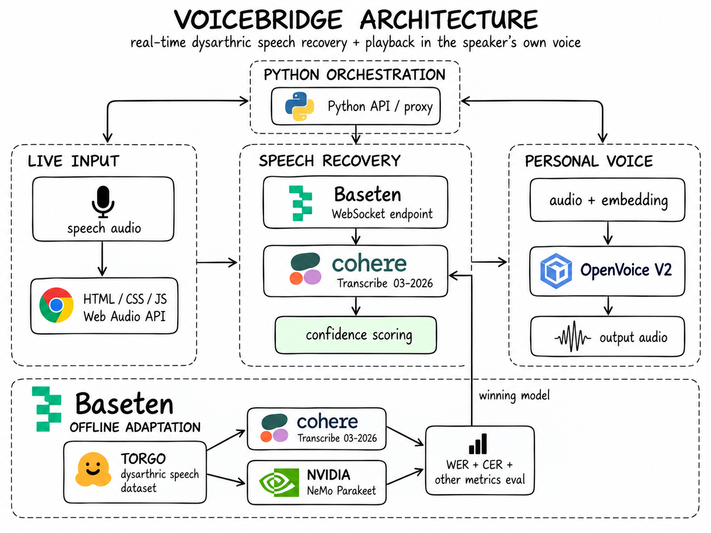

<div align="center">

<h1>VoiceBridge</h1>
<p>Speech recovery for dysarthric speakers, spoken back in the speaker's own voice.</p>
</div>

---

## The problem

Dysarthria is a motor speech disorder: stroke, cerebral palsy, Parkinson's or
ALS weaken the muscles that produce speech. The person knows what they want to
say. It comes out slurred, and listeners stop understanding them.

Ordinary speech recognition makes this worse. It does not fail visibly, it
produces fluent, confident, wrong English. On our held-out speaker the baseline
heard *"why yelled a warrior of a silly agent"* for *"why yell or worry over
silly items"*, and reported high confidence doing it. When you depend on that
transcript to be understood, a confident wrong answer is worse than none.

VoiceBridge does three things:

1. **Recovers the words.** A LoRA adapter over Cohere Transcribe cuts word error
   rate 38.6% on a speaker it never heard.
2. **Asks when the evidence is weak** instead of guessing, and shows the
   alternatives it was choosing between.
3. **Speaks the result in the person's own voice**, from a voice print taken
   from their own recordings.

## How it works



A clip or the microphone streams 20 ms PCM frames to the recognizer over a
WebSocket. Cohere Transcribe, adapted with LoRA, returns a revised transcript
every 400 ms. Above 0.879 confidence the text is accepted; below it the system
asks, offering beam-search alternatives. The confirmed sentence goes to MeloTTS,
and OpenVoice V2 repaints it in the speaker's own timbre.

Three decisions carry the weight:

- **Only the encoder matters.** Dysarthria is acoustic, not linguistic, and the
  encoder holds 91.8% of the parameters. The adapter trains 3.4M weights,
  **0.166% of the model**, in 10.6 minutes on one H100.
- **Confidence is computed here.** Neither model ships a usable one, so we derive
  it from token log-probabilities and calibrated the 0.879 threshold on 244
  held-out decodes for 95% precision.
- **Voice conversion, not voice cloning.** OpenVoice transfers timbre only.
  Cloning the full delivery would reproduce the slurring we exist to remove.

### Stack

- **ASR** Cohere Transcribe 03-2026 (2.07B, Apache 2.0), LoRA via PEFT
- **Training and serving** Baseten, one H100, Truss with a WebSocket transport
- **Voice** OpenVoice V2 tone-color conversion over MeloTTS
- **Data** TORGO dysarthric speech corpus, 8 impaired speakers
- **Frontend** one static HTML file, no framework, no build step
- **Python** 3.13, uv, PyTorch

## Results

Speaker M02, held out from training and from every model-selection decision,
then decoded once. 388 clips.

| Metric | Baseline | Fine-tuned | |
|---|---:|---:|---|
| Word error rate | 0.5668 | **0.3481** | **38.6% better** |
| Isolated words | 1.0169 | **0.4628** | **54.5% better** |
| Safety-critical errors | 0.4000 | **0.2857** | **28.6% better** |
| Clips exactly right | 98 / 388 | **198 / 388** | **2.0x** |

All eight speakers improved, and safety-critical errors worsened in none. The
gain grows with severity: **70.9%** on the most impaired speaker. Full tables in
[docs/RESULTS.md](docs/RESULTS.md).

## Limitations

- 34.8% error on the held-out speaker is still high. The claim is the relative
  reduction, not that the problem is solved.
- Two of eight speakers are genuinely held out. Evidence, not proof.
- TORGO is read prompts. On spontaneous conversational speech from outside the
  corpus the adapter did not transfer: baseline 0.654, tuned 0.731. It is
  specialized, not universally better.
- LoRA costs latency, p95 154 ms to 216 ms. At 39x real time this does not
  matter, but it is not a win.

## Run it

Needs a Baseten API key and the TORGO dataset, which is not redistributed here.

```bash
uv sync && source env.sh
export BASETEN_API_KEY=...        # the page never sees this; app/serve.py holds it

uv run hf download abnerh/TORGO-database --repo-type dataset --local-dir "$VOICEBRIDGE_DATA/torgo-dataset"
uv run python -m data.prepare_torgo --source "$VOICEBRIDGE_DATA/torgo-dataset"
uv run python -m contract.manifest
uv run python demo/curate_clips.py
```

Then two processes, and open <http://127.0.0.1:5173>:

```bash
uv run python -m app.serve                                    # page + ASR proxy
cd serve/voice && uv run --no-sync python server.py           # voice renderer
```

`uv run python scripts/e2e_check.py` drives the same chain without a browser.

### Running without Baseten

The same adapter serves locally on an Apple Silicon GPU. Needs **24 GB** of
unified memory: the 2.07B weights take about 4 GB in bfloat16, and the voice
renderer adds 2 GB more. A 16 GB machine runs out.

Set up a fresh machine:

```bash
git clone https://github.com/rickytang666/hackthenorth && cd hackthenorth
uv sync && source env.sh

hf auth login                                      # accept the licence first at
hf download CohereLabs/cohere-transcribe-03-2026   # huggingface.co/CohereLabs/cohere-transcribe-03-2026

cd serve/voice && ./fetch_openvoice.sh && uv sync && cd ../..
```

The LoRA adapter is committed at `serve/asr_cohere/packages/best`, so there is
nothing to transfer. The demo clips are not, because they are TORGO audio: either
rebuild them with the dataset steps above, or copy `app/clips/` from a machine
that has them, about 1.5 MB.

Then three processes instead of two:

```bash
uv run python -m serve.local_runner --module serve.asr_cohere.model.model --port 8766
ASR_WS_URL=ws://127.0.0.1:8766 uv run python -m app.serve
cd serve/voice && uv run --no-sync python server.py
```

Loading the model takes about 50 seconds. Check it with
`uv run python scripts/e2e_check.py --asr ws://127.0.0.1:8766`, which needs no
API key against a local endpoint.

Local decoding is close to but not identical with the H100: bfloat16 accumulates
in a different order on Metal, so a low-confidence clip can reorder its
candidates. Six of the seven demo clips return the identical transcript; the
seventh, at 0.74 confidence, promotes a different beam to the top.

Built with the [TORGO database](https://huggingface.co/datasets/abnerh/TORGO-database),
downloaded separately under its own terms. Base model Apache 2.0; OpenVoice V2
and MeloTTS MIT.
